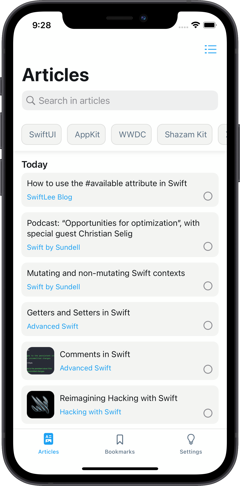
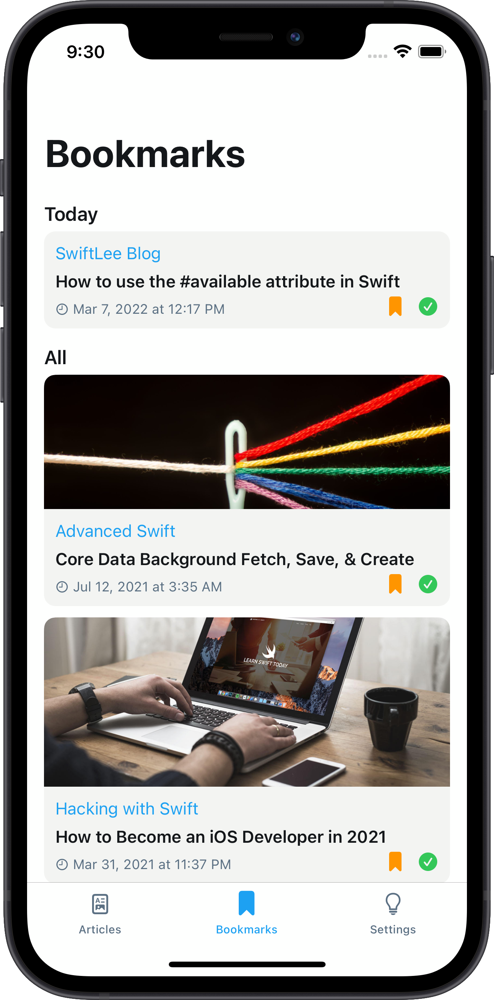
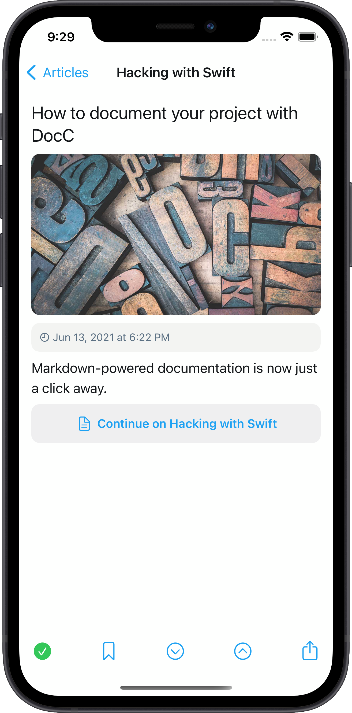
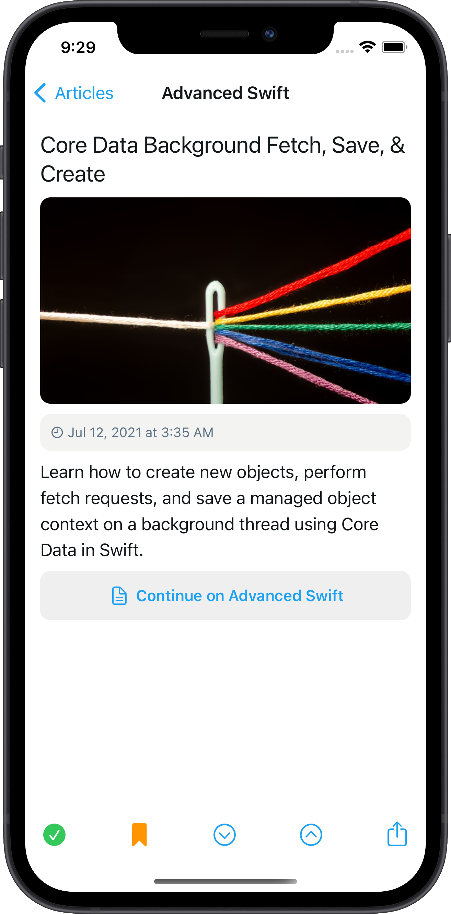

<p align="center">
    
</p>


# RSS-Feed
RSS-Feed App template
<p>
  
  
    
</p>

<p>
This project is powered by <a href="https://github.com/imodeveloperlab/dskit"> DSKit </a> a Design System Kit for iOS 13+, an iOS SDK written in Swift with a collection of reusable components, guided by clear standards, that can be assembled to build any number of applications.
</p>

## Config
You can config your app to load any rss source.

```swift
// Update once in 5 minutes by default, time interval in seconds
let updatePeriodicity: Double = 60*5

// RSS Sources
let rssSources = [RSSSource(title: "Hacking with Swift", url: "https://www.hackingwithswift.com/articles/rss"),
                  RSSSource(title: "Advanced Swift", url: "https://www.advancedswift.com/rss/"),
                  RSSSource(title: "IOSCREATOR", url: "https://www.ioscreator.com/tutorials?format=RSS"),
                  RSSSource(title: "Ole Begemann's Blog", url: "https://oleb.net/feed"),
                  RSSSource(title: "SwiftLee Blog", url: "https://www.avanderlee.com/feed/"),
                  RSSSource(title: "YASB", url: "https://www.vadimbulavin.com/feed.xml"),
                  RSSSource(title: "The.Swift.Dev", url: "https://theswiftdev.com/rss.xml"),
                  RSSSource(title: "Swift by Sundell", url: "https://swiftbysundell.com/rss")]

let readPropertyListFromServer: Bool = false

// Path to file on server to a property list
// Server url should be HTTPS
// Also even if you set readPropertyListFromServer = true and
// your sources will load from server, you should populate rssSources property
// with base sources to be able to load resources even if your server will have some
// problems to respond

// For an example of plist file you should load on server please check rss_feed.plist
let propertyListServerResourceUrl = "https://dskit.app/rss_feed.plist"

// This list of filters will be displayed on home screen, if you don't need
// filters to be shown, just set `let filters = [String]()` empty array
let filters = ["SwiftUI", "AppKit", "WWDC", "Shazam Kit", "XCode", "Catalyst", "Streamline"]
```

## Documentation

* [Documentation](https://dskit.app/components)
* [Code Example](https://dskit.app/home-code-example)
* [Layout](https://dskit.app/layout)
* [Appearance](https://dskit.app/appearance)

## Interfaces

<table>
  <tr>
    <td></td>
    <td></td>
    <td></td>
  <tr>  
   <tr>
    <td></td>
    <td></td>
    <td></td>
  </tr>  
</table>
